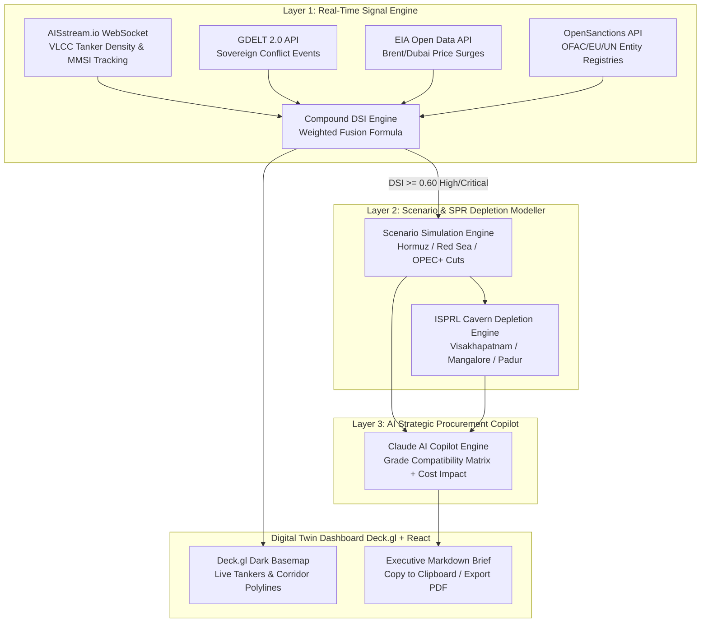

# INDRA — India's National Disruption Response Architecture
### AI-Driven Energy Supply Chain Resilience & Strategic Procurement Engine for Import-Dependent Economies

[](https://economictimes.indiatimes.com/)
[](file:///C:/Users/roopa/OneDrive/Desktop/hackathons/ET-Indra/PROBLEM_AND_FACT_BASE.md)
[](file:///C:/Users/roopa/OneDrive/Desktop/hackathons/ET-Indra/backend)
[](file:///C:/Users/roopa/OneDrive/Desktop/hackathons/ET-Indra/frontend)
[](file:///C:/Users/roopa/OneDrive/Desktop/hackathons/ET-Indra/backend/copilot.py)

---

## 🚀 Executive Summary (The Pitch in Three Sentences)
1. India spends **$122 billion annually** on imported crude oil (`90.4% import dependence`), routes over `70%` of it through three volatile maritime chokepoints (`Strait of Hormuz`, `Red Sea`, `Cape of Good Hope`), and holds **9.5 days** of underground Strategic Petroleum Reserve (SPR) cover — yet relies on manual, uncoordinated intelligence when geopolitical crises erupt.
2. **INDRA** fuses real-time AIS vessel telemetry, GDELT geopolitical conflict events, EIA global oil price deviations, and OpenSanctions entity registries into a mathematical **Disruption Signal Index (DSI)** across each corridor, updated every 30 minutes.
3. When a disruption crosses a critical threshold, INDRA compresses the traditional **47-day manual decision cycle into less than 60 seconds**, generating a **refinery-grade-compatible procurement and SPR release brief** tailored specifically to India's 23 national refineries and 3 underground rock cavern complexes.

---

## 🌐 Live System Architecture & Flow



---

## 🔥 Key Innovations & Technical Differentiators

### 1. The Disruption Signal Index (DSI) Formula
Instead of isolated charts, INDRA computes a unified compound disruption score ($0.0 \to 1.0$) for each maritime chokepoint:
$$\text{DSI}(c, t) = \left(Z_{\text{density}} \times 0.40\right) + \left(C_{\text{gdelt}} \times 0.35\right) + \left(P_{\text{eia}} \times 0.15\right) + \left(S_{\text{sanctions}} \times 0.10\right)$$
* **$Z_{\text{density}}$ (40% Weight):** Rolling 7-day z-score of Very Large Crude Carrier (VLCC) counts inside the corridor bounding box from **AISstream.io WebSockets**.
* **$C_{\text{gdelt}}$ (35% Weight):** Normalized GoldsteinScale conflict event intensity for regional sovereign actors from **GDELT 2.0**.
* **$P_{\text{eia}}$ (15% Weight):** Percentage price deviation of Brent/Dubai crude from the 30-day moving average (`+$18–24/bbl surge`).
* **$S_{\text{sanctions}}$ (10% Weight):** Sovereign sanctions exposure score tracked via **OpenSanctions**.

### 2. Refinery-Grade-Compatible AI Copilot (`claude-3-5-haiku-20241022`)
A recommendation to *"buy US WTI light sweet crude"* is useless for a refinery configured solely for *"Arabian Heavy sour crude"* (like RIL Jamnagar DTA). INDRA injects India's **23-Refinery Technical Compatibility Matrix** into the Claude system prompt. The AI evaluates crude sulfur content (`API Gravity & Sulfur %`), pipeline connectivity, and coastal port drafts before generating exact action items.

### 3. National SPR Cavern Depletion Engine
INDRA models real-time drawdown curves across India's three underground rock cavern storage facilities managed by **ISPRL**:
* **Visakhapatnam (`1.33 MMT`):** Feeds east coast refineries (`Paradip`, `Vizag`).
* **Mangalore (`1.50 MMT`):** Feeds west coast refineries (`MRPL Mangalore`, `BPCL Kochi`).
* **Padur (`2.50 MMT`):** India's primary deep-underground strategic reserve.
* *Interactive What-If Simulation:* Instantly recalculates remaining survival days (`34.6d to 130.0d`) when testing baseline drawdowns, 14-day Cape transit delays, or dual Hormuz + Red Sea blockades.

### 4. Interactive Sensitivity Sandbox & Deck.gl Digital Twin
* **Interactive Sliders (`[ ⚙️ SANDBOX ]`):** Allows judges to dynamically tweak Tanker Density, Geopolitical Threat Index, and Price Deviations during live presentations to watch the formula recompute in real time.
* **Deck.gl Geospatial Digital Twin:** Renders animated shipping corridors (`PathLayer`), live tanker traffic (`TripsLayer`/Dots), and Indian refinery/port locations (`ScatterplotLayer` for `Mundra`, `JNPT`, `Paradip`, `Kochi`, etc.) with zero UI clutter.

---

## 📊 Documentation & Judging Guides
* 📖 [Verified Problem Statement & Fact Base](file:///C:/Users/roopa/OneDrive/Desktop/hackathons/ET-Indra/PROBLEM_AND_FACT_BASE.md) — Comprehensive breakdown of India's $122B crude bill, 23 refineries, and prior art comparison.
* 🏛️ [System Architecture & Data Flows](file:///C:/Users/roopa/OneDrive/Desktop/hackathons/ET-Indra/ARCHITECTURE.md) — Deep technical documentation of our 3-layer architecture, DB models, and fallback mechanisms.
* 🏆 [Judging Criteria Mapping & 3-Minute Demo Script](file:///C:/Users/roopa/OneDrive/Desktop/hackathons/ET-Indra/JUDGING_CRITERIA.md) — Step-by-step walkthrough designed specifically for the jury evaluation.
* 🛠️ [Deployment Guide](file:///C:/Users/roopa/OneDrive/Desktop/hackathons/ET-Indra/DEPLOY.md) — Production setup across Render, Vercel, Railway, and Neon PostgreSQL.

---

## ⚡ Quickstart (Running Locally)

### Prerequisites
* Python `3.11+`
* Node.js `18+` & `npm`

### 1. Start the FastAPI Backend
```bash
cd backend
python -m venv venv
# On Windows: venv\Scripts\activate
# On macOS/Linux: source venv/bin/activate
pip install -r requirements.txt
python -m uvicorn main:app --host 0.0.0.0 --port 8000 --reload
```
*The backend API will run at `http://localhost:8000`. Swagger API docs available at `http://localhost:8000/docs`.*

### 2. Start the React Deck.gl Frontend
```bash
cd frontend
npm install
npm run dev
```
*Open your browser to `http://localhost:5173` to interact with the digital twin.*

---
*Built with precision for the **Economic Times AI Hackathon 2026**.*
